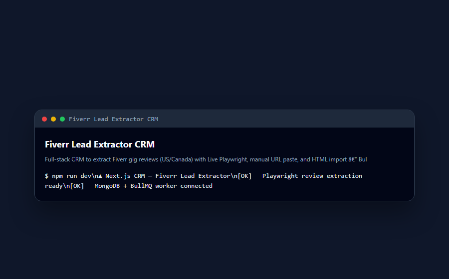

<div align="center">

# 🚀 Fiverr Lead Extractor CRM

**Full-stack CRM to extract Fiverr gig reviews (US/Canada) with Live Playwright, manual URL paste, and HTML import - BullMQ worker, MongoDB, Excel export, admin panel, and Electron desktop app.**

Documented - MIT licensed - Maintained

[](https://www.typescriptlang.org/)
[](LICENSE)
[](CONTRIBUTING.md)

</div>

---

## Screenshots




## 🐍 Contribution graph

<picture>
  <source media="(prefers-color-scheme: dark)" srcset="https://raw.githubusercontent.com/mafzalkalwardev/fiverr-lead-extractor-crm/output/snake-dark.svg" />
  <source media="(prefers-color-scheme: light)" srcset="https://raw.githubusercontent.com/mafzalkalwardev/fiverr-lead-extractor-crm/output/snake.svg" />
  
</picture>

---

<p align="center">
  
</p>

<p align="center">
  
  
  
  
</p>

## Custom Project Showcase

Fiverr Lead Extractor CRM is a Windows-ready lead collection system built for Fiverr research workflows. It combines a Next.js CRM dashboard, MongoDB-backed job tracking, Excel export, and a Python Playwright scraper that discovers gigs, reads public reviews, filters US/Canada buyers, and saves usable lead records.

The standout achievement is the automatic verification workflow for Fiverr press-and-hold challenges. The scraper detects human verification pages, focuses the browser, searches challenge targets across frames and dynamic DOM states, performs controlled press-and-hold attempts, keeps the session alive, and resumes the same job from the saved gig checkpoint when the challenge clears.

## Trophy Cards

| Achievement | Result |
|---|---|
| Automatic press-and-hold verification handling | Detects PerimeterX/Fiverr human-touch pages, attempts page-scoped press-and-hold, and resumes extraction after clearance. |
| Resume-safe scraper jobs | Saves `gigQueue`, `resumeIndex`, current gig state, failed URLs, and activity logs so jobs can continue after pause, retry, timeout, or verification. |
| Review-focused lead quality | Filters public reviews by target country and protects against seller, agency, profile, and main gig images being mistaken for buyer review images. |
| Client-ready Windows launch | Includes repair/start scripts, shortcut support, portable MongoDB flow, Electron launcher wiring, and local data paths. |

## Stats Cards

| Area | Stack | What It Does |
|---|---|---|
| CRM | Next.js 15, React 19, Tailwind CSS | Login, dashboard, jobs, leads, gigs, reviews, admin pages, activity timeline. |
| Scraper | Python, Playwright, persistent Chromium profile | Fiverr search discovery, gig parsing, review extraction, verification watcher. |
| Data | MongoDB, Mongoose, ExcelJS | Stores users, jobs, leads, gigs, reviews, progress, failed URLs, and exports XLSX. |
| Automation | PowerShell, BAT, Electron | Starts MongoDB, frees ports, clears browser locks, runs web app and scraper together. |

<p align="center">
  
  
</p>

## Activity Graph

<p align="center">
  
</p>

## Skill Icons

<p align="center">
  
</p>

## Main Features

- Secure local CRM with login, dashboard metrics, job monitor, admin views, lead tables, and Excel export.
- Fiverr discovery from keywords or pasted gig URLs.
- Two review image modes: strict buyer review image collection or faster review-only collection.
- US/Canada review targeting with normalized lead fields.
- Same-keyword continuation that skips gig URLs already queued for that user.
- Failed gig logging with retry support and saved screenshots/HTML under ignored `test-results/`.
- Automatic verification watcher for press-and-hold pages, separate challenge tabs, resume navigation, and job heartbeat updates.
- Browser-extension hydration cleanup for `bis_skin_checked` so extension attributes do not break Next.js hydration.

## Verification Workflow

The Python scraper watches for Fiverr verification signals such as `press & hold`, `human touch`, `px-captcha`, PerimeterX text, and browser integrity pages. When detected, it:

1. Marks the job as `verification_required`.
2. Keeps the persistent browser session open.
3. Locates the press-and-hold target across frames, selectors, text, canvas fallbacks, and dynamic DOM checks.
4. Runs automatic hold attempts with natural mouse movement and configurable retry timing.
5. Rechecks the original gig/search URL and resumes from the saved checkpoint after verification clears.

This is designed for continuity and reliability. It does not promise to bypass every CAPTCHA; if a challenge requires manual completion, the browser remains open and the worker continues automatically after the user finishes it.

## Quick Start

```powershell
cd "C:\Users\pc\Desktop\Fiverr Scraper"
npm install
python -m venv venv
venv\Scripts\activate
pip install -r python_scraper\requirements.txt
playwright install chromium
npm run seed:admin
npm run client:start:fast
```

Open:

```text
http://localhost:3000/login
```

Default local admin comes from `.env`:

```text
admin@ftsolutions.local
Admin@FT2024
```

## Local Data

The app starts a bundled or downloaded portable MongoDB runtime and stores customer data per Windows user:

```text
C:\Users\<User>\AppData\Local\FiverrLeadCRM\data\db
C:\Users\<User>\AppData\Local\FiverrLeadCRM\logs\mongod.log
```

Default database URI:

```env
MONGODB_URI=mongodb://127.0.0.1:27017/fiverr-lead-extractor-crm
```

If port `27017` is busy, startup can use `27018` and update `.env` automatically.

## Useful Commands

```powershell
npm run client:start:fast
npm run client:repair
npm run build
npx tsc --noEmit
npm run scraper:py
npm run setup:browser:py
npm run migrate:jobs
```

## Reverse Engineering Workbench

This repo also includes a local static-analysis workbench for authorized file review. It can inspect EXE/PE files, PowerShell scripts, Python/scripts, ZIP archives, and other file types without executing the target. Reports include hashes, strings, indicators, structure, Markdown/JSON output, and a runnable Python behavior scaffold.

Run the GUI:

```powershell
py -3 -m reverse_engineering_workbench.app
```

Analyze from the CLI:

```powershell
py -3 -m reverse_engineering_workbench.app "path\to\file.exe" -o analysis_reports
```

Generated code is a behavior scaffold, not exact recovered source. Install `pefile` for deeper PE import and section parsing.

## Windows Launcher

`Start Fiverr Lead CRM.bat` starts the local CRM flow: frees port `3000`, clears browser locks, starts MongoDB, launches the Next.js app and Python scraper, and opens the login page. The Electron entry is wired through `electron/main.js` for desktop-style launching.

## Focused SEO Keywords

`Fiverr lead extractor`, `Fiverr scraper CRM`, `Fiverr review scraper`, `Fiverr buyer leads`, `Playwright Fiverr automation`, `Next.js CRM dashboard`, `MongoDB lead management`, `automatic press and hold verification`, `PerimeterX verification handling`, `US Canada Fiverr leads`, `Fiverr gig review extraction`, `Fiverr lead generation software`.

## Contribution Snake

<p align="center">
  
</p>

